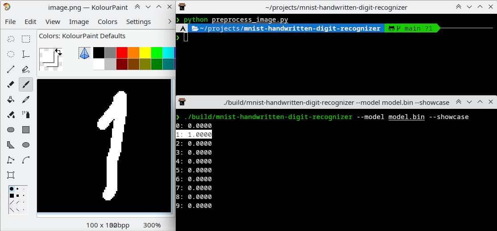
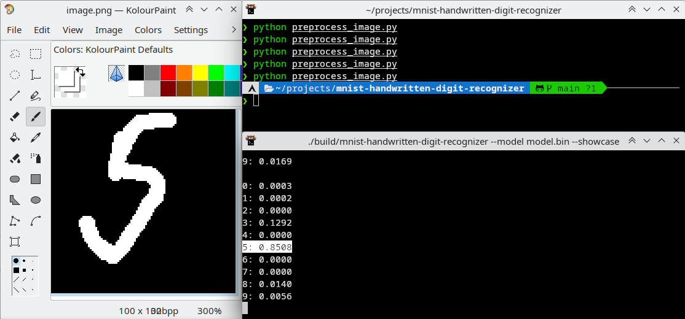
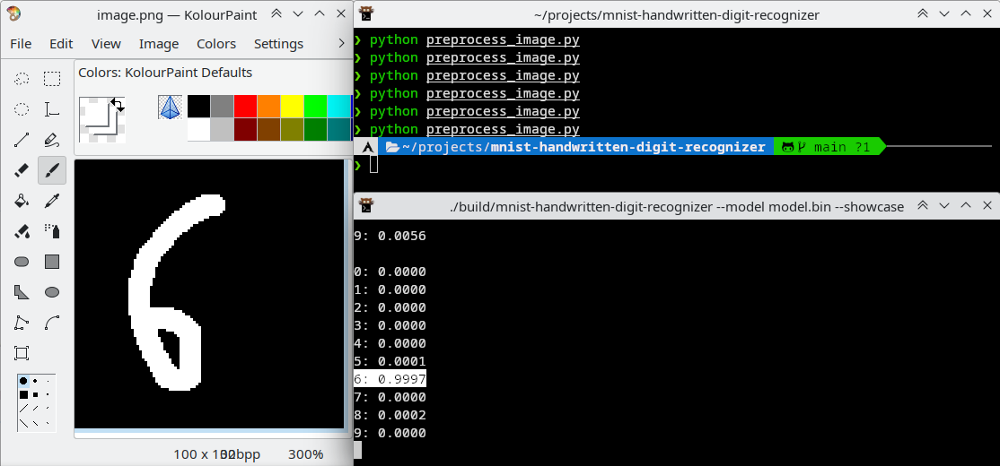

# mnist-handwritten-digit-recognizer

DIY neural network for digit recognition

## Showcase





## Features

* Train and run neural network for handwritten digit recognition using [MNIST database of handwritten digits](http://yann.lecun.com/exdb/mnist/) (or other compatible dataset).
* Simple process of running neural network: draw digit in Paint, run `preprocess_image.py`, and run built binary.
* Dump dataset entries into a directory with PNGs.
* Set learning hyperparameters and optimizer from command line.
* Available optimizers: SGD (Stochastic Gradient Descent), SGD with Momentum, Adam.
* Change network architecture and error function using flexible layer architecture (through code edition).

## Build under Linux

Though it also should be possible to build it on any platform supported by Meson build system, only Linux build has been tested.

Required dependencies:

* [Meson](https://mesonbuild.com/)
* [tclap](https://sourceforge.net/projects/tclap/)
* openmp

When all dependencies are installed, run the following commands in project root:

```sh
CXXFLAGS="-Ofast" meson setup build
meson compile -C build
```

`build/mnist-handwritten-digit-recognizer` is the compiled binary.

## Usage

1. Download MNIST database of handwritten digits.
Go to [http://yann.lecun.com/exdb/mnist/](). You need four files:

    * train-images-idx3-ubyte.gz
    * train-labels-idx1-ubyte.gz
    * t10k-images-idx3-ubyte.gz
    * t10k-labels-idx1-ubyte.gz

    Download and uncompress them. Place uncompressed files in single directory. It should look like this:

    ```
    $ tree -h mnist
    [4.0K]  mnist
    ├── [7.5M]  t10k-images-idx3-ubyte
    ├── [9.8K]  t10k-labels-idx1-ubyte
    ├── [ 45M]  train-images-idx3-ubyte
    └── [ 59K]  train-labels-idx1-ubyte

    1 directory, 4 files
    ```

2. Train neural network using dataset.

    ```
    $ mnist-handwritten-digit-recognizer --model model.bin --train --dataset mnist --optimizer SGD
    Samples:   1000; epoch:      0; accuracy: 0.5270; mean error: 1.5008838
    Samples:   2000; epoch:      0; accuracy: 0.7610; mean error: 0.8031709
    Samples:   3000; epoch:      0; accuracy: 0.8350; mean error: 0.5456356
    Samples:   4000; epoch:      0; accuracy: 0.8530; mean error: 0.4957425
    Samples:   5000; epoch:      0; accuracy: 0.8630; mean error: 0.4427706
    Samples:   6000; epoch:      0; accuracy: 0.8780; mean error: 0.4314919
    Samples:   7000; epoch:      0; accuracy: 0.8950; mean error: 0.3564226
    Samples:   8000; epoch:      0; accuracy: 0.8680; mean error: 0.4334423
    Samples:   9000; epoch:      0; accuracy: 0.8610; mean error: 0.4559900
    Samples:  10000; epoch:      0; accuracy: 0.8970; mean error: 0.3548307
    Samples:  11000; epoch:      0; accuracy: 0.9080; mean error: 0.3086879
    Samples:  12000; epoch:      0; accuracy: 0.8930; mean error: 0.3717598
    Samples:  13000; epoch:      0; accuracy: 0.8770; mean error: 0.3999026
    Samples:  14000; epoch:      0; accuracy: 0.8850; mean error: 0.4181863
    Samples:  15000; epoch:      0; accuracy: 0.8770; mean error: 0.4330435
    Samples:  16000; epoch:      0; accuracy: 0.8930; mean error: 0.3689872
    Samples:  17000; epoch:      0; accuracy: 0.8970; mean error: 0.3298718
    Samples:  18000; epoch:      0; accuracy: 0.8800; mean error: 0.3696812
    Samples:  19000; epoch:      0; accuracy: 0.9270; mean error: 0.2592739
    Samples:  20000; epoch:      0; accuracy: 0.9200; mean error: 0.2686670
    Samples:  21000; epoch:      0; accuracy: 0.9040; mean error: 0.3497801
    Samples:  22000; epoch:      0; accuracy: 0.9310; mean error: 0.2532274
    Samples:  23000; epoch:      0; accuracy: 0.9030; mean error: 0.3092292
    Samples:  24000; epoch:      0; accuracy: 0.9010; mean error: 0.3182725
    Samples:  25000; epoch:      0; accuracy: 0.8930; mean error: 0.3215333
    Samples:  26000; epoch:      0; accuracy: 0.9180; mean error: 0.2465388
    Samples:  27000; epoch:      0; accuracy: 0.9070; mean error: 0.3400893
    Samples:  28000; epoch:      0; accuracy: 0.9160; mean error: 0.2737796
    Samples:  29000; epoch:      0; accuracy: 0.9220; mean error: 0.2767991
    Samples:  30000; epoch:      0; accuracy: 0.9000; mean error: 0.3249092
    Parameters saved
    Samples:  31000; epoch:      0; accuracy: 0.9030; mean error: 0.3010238
    ^C
    ```

    Assuming `mnist` is a directory from step 1, and `model.bin` is a file to which model parameters will be saved.

    By default, if model file exists, it will be overwritten. To train existing model use `--train-existing-model` flag.

    To train with dropout (actually noise) layers use `--train-with-dropout` flag.

    To view all available arguments, use `--help` flag.

3. Compute model accuracy on the test dataset.

    ```
    $ mnist-handwritten-digit-recognizer --model model.bin --compute-test-accuracy --dataset mnist
    Test set accuracy: 0.9073
    ```

    The best accuracy I achived with current architecture was about 0.945.

4. Evaluate model using your own digits.

    1. Somehow create `image.png` in current working directory (e.g. using Paint).

    2. Run `preprocess_image.py` Python script. It will look for `image.png` in current working directory, do some stuff and create `image.bin` in current working directory. It will also create `preprocessed.png` - an image containing preprocessing result.

    3. Run program in showcase mode:

        ```
        $ mnist-handwritten-digit-recognizer --model model.bin --showcase
        0: 0.0000
        1: 0.0000
        2: 1.0000
        3: 0.0000
        4: 0.0000
        5: 0.0000
        6: 0.0000
        7: 0.0000
        8: 0.0000
        9: 0.0000
        ```

        It will give probabilities of image being each digit. The highest probability will be highlighted with white background.

    4. Repeat steps 1-2, and send Enter to running `mnist-handwritten-digit-recognizer`. It will reload image and evaluate model on it. It is not necessary to restart it every time.

### Dumping images from dataset to a directory

```
mnist-handwritten-digit-recognizer --dataset mnist --dump-dataset mnist_images
python dump_dataset.py mnist_images
```

It will create `mnist_images_pngs` directory. It will contain PNG files with the following name format: `{image index}_{image class}.png`.

## Using custom MNIST-like dataset

🚧 TODO
